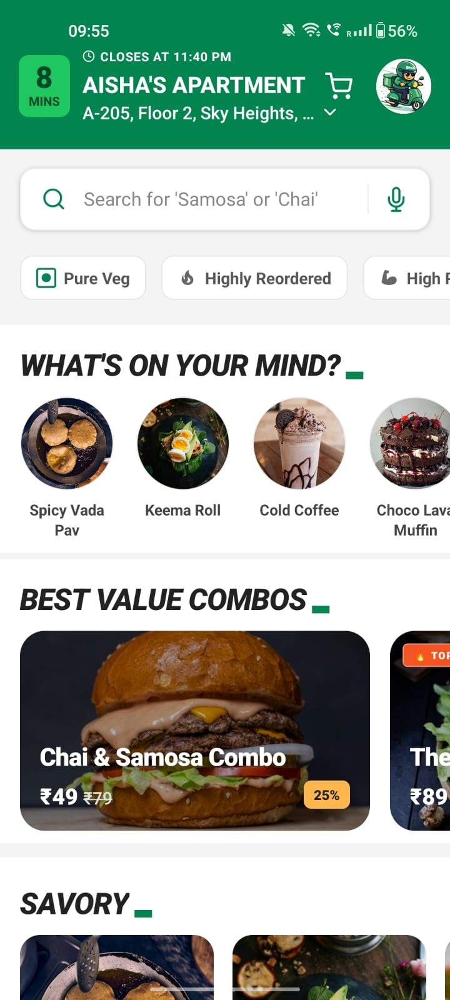
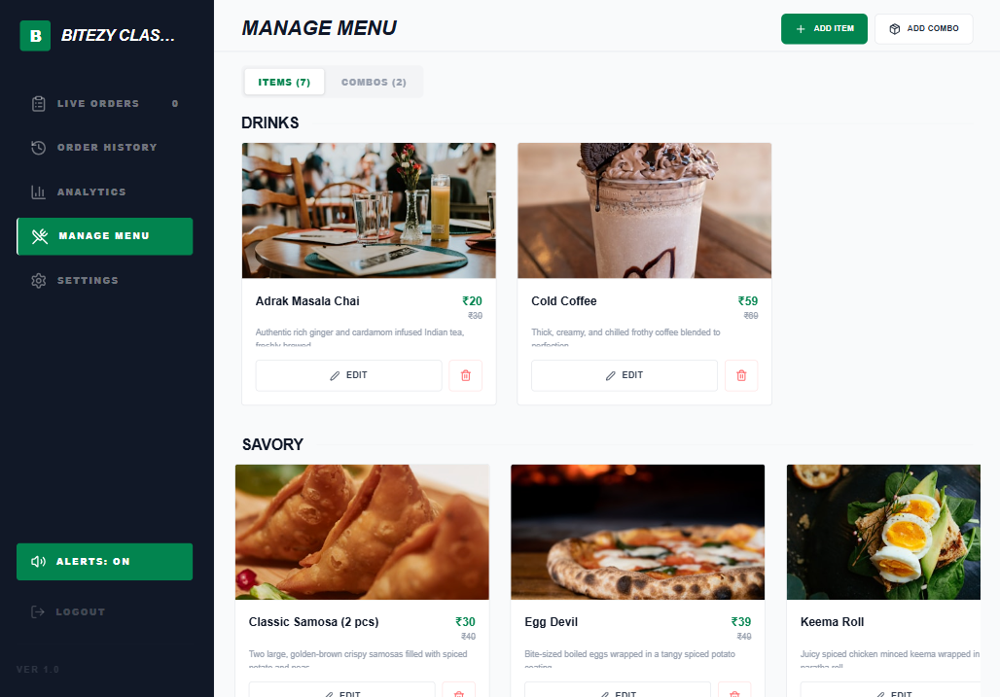
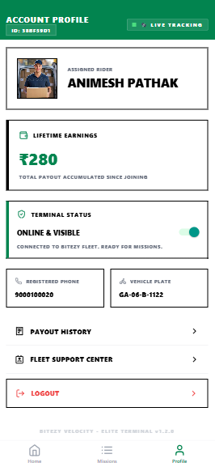
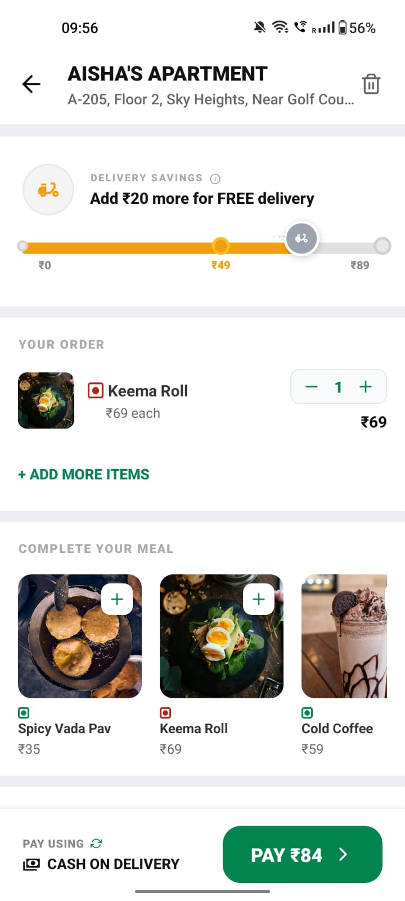
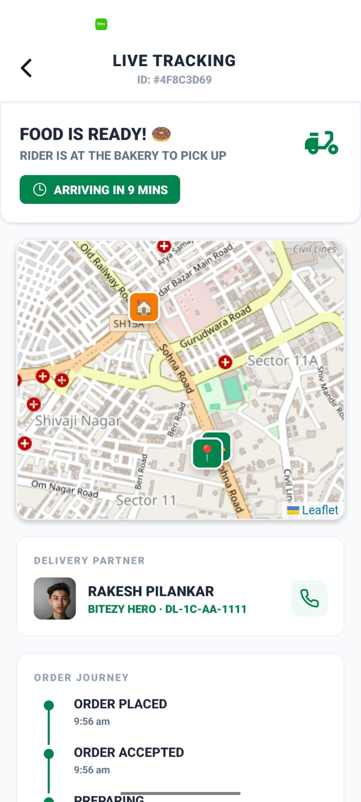
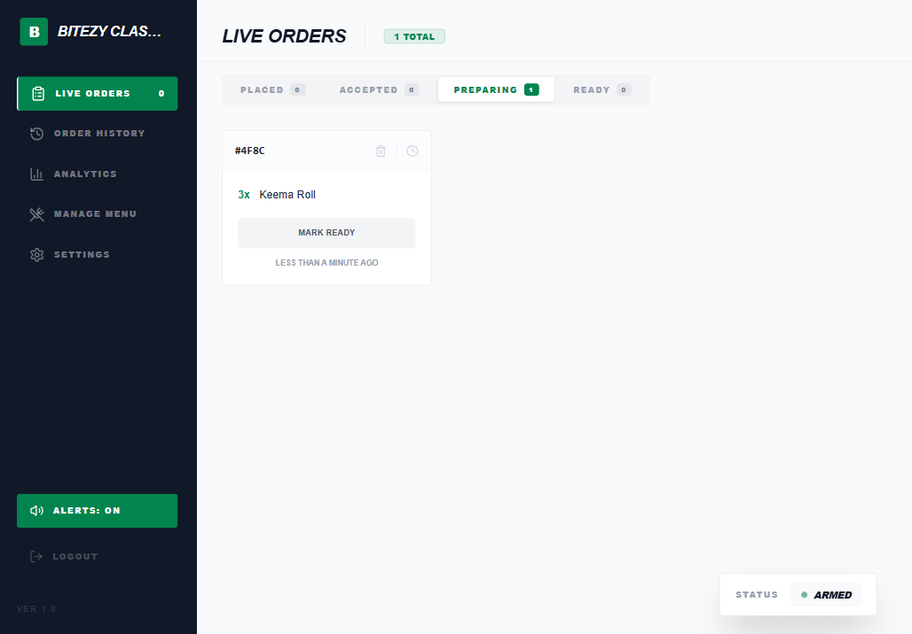
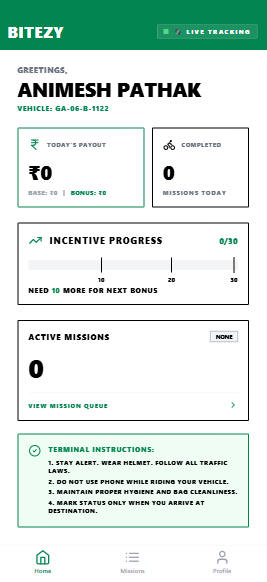

# ⚡ Bitezy - Hyperlocal 10-Minute Snack Delivery Ecosystem

**Bitezy** is a next-generation hyperlocal logistics engine designed for the quick-food sector. It delivers fresh bakery snacks and curated combos to users in under 10 minutes by leveraging a high-density "Zone Model" and a proprietary just-in-time dispatch algorithm.

This repository contains the complete ecosystem:
1.  **📱 User App**: The consumer-facing storefront.
2.  **🏪 RMS (Restaurant Management System)**: A high-performance dashboard for bakery operations.
3.  **🛵 Rider App**: The logistics cockpit for delivery partners.

---

## 📸 App Screenshots

| User App | Restaurant Management System | Rider App |
| :---: | :---: | :---: |
|  <br> *Interface & Menu* |  <br> *Analytics Dashboard* |  <br> *Logistics Cockpit* |

### 🔍 System Deep-Dive

#### 📱 User Experience
<p align="center">
  
  
</p>

#### 🏪 Restaurant Management (RMS)
<p align="center">
  
</p>

#### 🛵 Rider Terminal
<p align="center">
  
</p>

---

## 🧠 The "Bitezy" Advantage

### 1. The 10-Minute Zone Model
Unlike traditional food delivery apps that cover entire cities, Bitezy operates in hyper-focused **600m radius zones**. Each zone has:
- One primary vendor (e.g., a high-quality local bakery).
- Dedicated riders stationed at the vendor.
- A restricted, high-conversion menu.

### 2. JIT Dispatch Algorithm
Our proprietary algorithm ensures that riders arrive at the bakery exactly when the food is ready.
- **Fixed Prep Time:** 2 minutes.
- **Predictive Assignment:** Rider assigned based on "Time to Bakery" syncing with "Prep Remaining".
- **Zero Idle Time:** Minimizing rider wait times at the pickup point.

### 3. Dynamic Pricing & Profitability
- **Fixed Rider Payout:** ₹15 per delivery.
- **Dynamic Delivery Fee:** Scaled based on cart value (₹25 → ₹15 → Free) to drive higher Average Order Value (AOV).
- **Cross-Subsidization:** High-value combos subsidize delivery costs for a seamless user experience.

---

## 🛠️ Tech Stack

### Mobile Ecosystem (User & Rider Apps)
- **Framework:** React Native (Expo SDK 52/55)
- **State Management:** React Context API / Hooks
- **Backend-as-a-Service:** Supabase (Real-time DB) & Firebase (Auth/Cloud Functions)
- **Maps & Location:** Expo Location, React Native Maps, Leaflet
- **UI:** Lucide Icons, Tailwind CSS (Native), Framer Motion (Reanimated)

### Web Ecosystem (RMS Dashboard)
- **Framework:** React + Vite (TypeScript)
- **Styling:** Tailwind CSS 4.0
- **Animations:** Framer Motion
- **Data Visualization:** Recharts
- **Icons:** Lucide React

---

## 📂 Repository Structure

```
Bitezy/
├── Bitezy/                # User Application (React Native)
├── Bitezy-Restaurant/     # Restaurant Management System (React Web)
└── Bitezy-Rider/          # Rider Application (React Native)
```

---

## 🚀 Getting Started

### Prerequisites
- Node.js (v18+)
- Expo Go (for mobile testing)
- Supabase & Firebase project credentials

### 1. Setup User/Rider Apps
```bash
cd Bitezy # or Bitezy-Rider
npm install
npx expo start
```

### 2. Setup RMS
```bash
cd Bitezy-Restaurant
npm install
npm run dev
```

---

## 🗺️ Roadmap
- [ ] **Phase 1:** Hyperlocal Snacks & Combos (Completed)
- [ ] **Phase 2:** High-Protein "Heat & Deliver" Meals
- [ ] **Phase 3:** Multi-Zone Scaling & Rider Batching
- [ ] **Phase 4:** AI-Powered Demand Prediction

---

## 📄 License
Internal use only. Proprietary software developed by Aayush Singh.


<!-- badge: pair-extraordinaire -->
